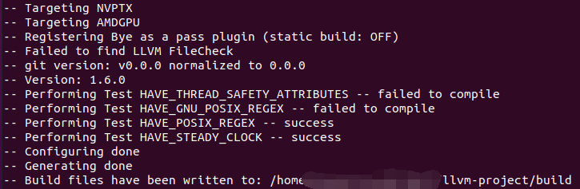
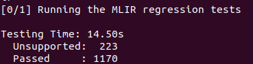
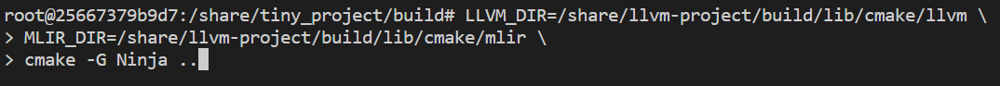
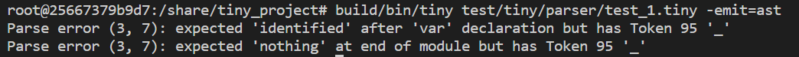

<!-- <style>
h1 {
    border-bottom: none
}
</style> -->

# <center> <font size=6>编译原理大作业</font>
## 实验环境：
* 操作系统（推荐）： Ubuntu 20.04
* 虚拟机软件（推荐）：VMware workstation pro
## 构建步骤（以Ubuntu为例）：
### 1. 前置工具： 
git, cmake, clang, lld, ninja
```
sudo apt install git
sudo apt install cmake
sudo apt-get install clang lld
sudo apt install ninja-build
```
### 2. 安装MLIR： 
```
git clone https://github.com/llvm/llvm-project.git
mkdir llvm-project/build
cd llvm-project/build
cmake -G Ninja ../llvm \
   -DLLVM_ENABLE_PROJECTS=mlir \
   -DLLVM_BUILD_EXAMPLES=ON \
   -DLLVM_TARGETS_TO_BUILD="X86;NVPTX;AMDGPU" \
   -DCMAKE_BUILD_TYPE=Release \
   -DLLVM_ENABLE_ASSERTIONS=ON \
   -DCMAKE_C_COMPILER=clang -DCMAKE_CXX_COMPILER=clang++ -DLLVM_ENABLE_LLD=ON
```
执行完上述步骤后会有如下提示：


 
之后执行：
```
cmake --build . --target check-mlir
```
如果运行结果如下图所示，证明MLIR已经安装并成功编译：


 

### 3. 安装tiny_project： 
```
git clone https://github.com/Jason048/tiny_project.git
mkdir build  
cd build
# 下面的LLVM_DIR和MLIR_DIR要改成自己llvm-project对应的路径

# 路径修改后，将下面的三行命令copy到build目录下的terminal中执行
LLVM_DIR=/Path/to/llvm-project/build/lib/cmake/llvm \
MLIR_DIR=/Path/to/llvm-project/build/lib/cmake/mlir \
cmake -G Ninja ..
```
例如:

 
这里需要根据你llvm-project的下载地址设置好LLVM_DIR和MLIR_DIR的路径。
### 4. 基础功能的实现与验证：

**词法分析器**(/tiny_project/tiny/include/tiny/Lexer.h)：
在Lexer.h搜索"TODO"，可以看到需要补充的代码位置。
实现以下功能

1).  能够识别“return”、“def”和“var”三个关键字<br>
2).  按照如下要求识别变量名：<br>
&emsp;•  变量名以字母开头<br>
&emsp;• 变量名由字母、数字和下划线组成<br>
&emsp;• 变量名中有数字时，数字应该位于变量名末尾<br>
&emsp;例如：有效的变量名可以是 a123, b_4, placeholder 等。

**语法分析器**(/tiny_project/tiny/include/tiny/Parser.h)：
在Parser.h搜索"TODO"，可以看到需要补充的代码位置。
实现以下功能

1).  语法变量必须以“var”开头，后面为变量名及变量类型，最后为变量的初始化<br>
2).  语法分析器能够识别如下三种表示：<br>
&emsp;• var a = \[[1, 2, 3], [4, 5, 6]] <br>
&emsp;• var a <2,3> = [1, 2, 3, 4, 5, 6]<br>
&emsp;• var a [2][3] = [1, 2, 3, 4, 5, 6]<br>
&emsp;注： var a [2][3] = ... 为我们新增的声明及定义方式，在本次作业中对于此种形式，我们只要求语法分析器能识别这种表示，生成对应的合法AST即可。如果想要在终端打印出Tensor信息，则需拓展Tiny dialect以支持此新增表示。

当你对词法分析器和语法分析器补充完毕后，可以运行以下指令来检查程序的正确性。

**词法分析器验证（test_1 - test_4）：**
以test_1为例：
build tiny并执行下面测试用例以验证词法分析器是否能够检测出错误的词法单元
```
cmake --build . --target tiny
cd ../
build/bin/tiny test/tiny/parser/test_1.tiny -emit=ast
```
如果执行结果如下图所示，表示词法分析器分析正确。



**语法分析器验证（test_5）：**
执行下面测试用例以验证语法分析器是否能够检测出var a [2][3] = ...类型
```
build/bin/tiny test/tiny/parser/test_5.tiny -emit=ast
```
如果执行结果如下图所示，表示语法分析器分析正确。

同学们还可以运行以下指令查看程序的运行结果：
```
build/bin/tiny test/tiny/parser/test_5.tiny -emit=jit
```
**代码优化**(/tiny_project/tiny/mlir/TinyCombine.cpp)：
在TinyCombine.cpp搜索"TODO"，可以看到需要补充的代码位置。
    
实现以下功能：
将tiny dialect的冗余转置代码优化pass补充完整。最终实现冗余代码的消除。

**代码优化验证（test_6）：**
对于test_6中的例子：
```
def transpose_transpose(x) {
  return transpose(transpose(x));
}

def main() {
  var a<2, 3> = [[1, 2, 3], [4, 5, 6]];
  var b = transpose_transpose(a);
  print(b);
}
```
执行以下指令，获取转换后的tiny dialect，并实现冗余转置操作的消除。
```
build/bin/tiny test/tiny/parser/test_6.tiny -emit=mlir -opt
```
转换后的code应如下：
```
tiny.func @main()
    [[VAL_1:%.*]] = tiny.constant dense<{{\[\[}}1.000000e+00, 
    2.000000e+00, 3.000000e+00], [4.000000e+00, 5.000000e+00, 6.000000e+00]]> : tensor<2x3xf64>
    tiny.print [[VAL_1]] : tensor<2x3xf64>
    tiny.return
```

同时，同学们还可以通过test_6实现一个完整的端到端流程：

对于测试文件test_6，按照以下顺序运行指令：

```
step 1: build/bin/tiny test/tiny/parser/test_6.tiny -emit=ast
```
得到.tiny文件的抽象语法树

```
step 2: build/bin/tiny test/tiny/parser/test_6.tiny -emit=mlir -opt
```
将代码从.tiny文件转换成.mlir文件，这里是否实现进阶部分内容会影响输出的.mlir代码。同学们可以自行比较两种方式下产生的代码并在报告中指出。


```
step 3: build/bin/tiny test/tiny/parser/test_6.tiny -emit=jit
```
得到tiny程序的运行结果，是否进行代码优化不会影响最终运行结果。
